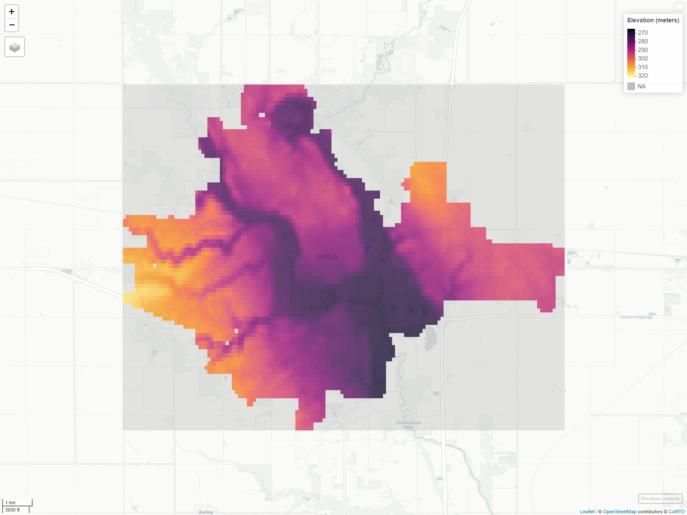
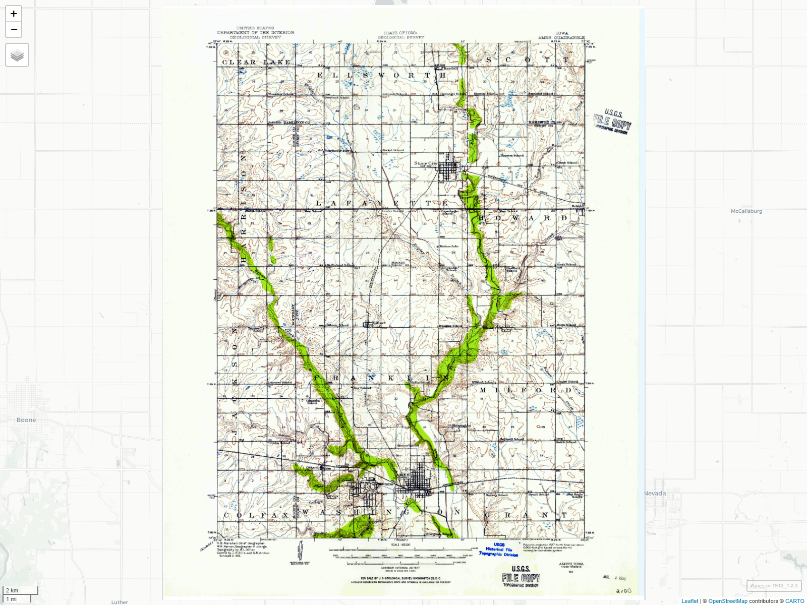
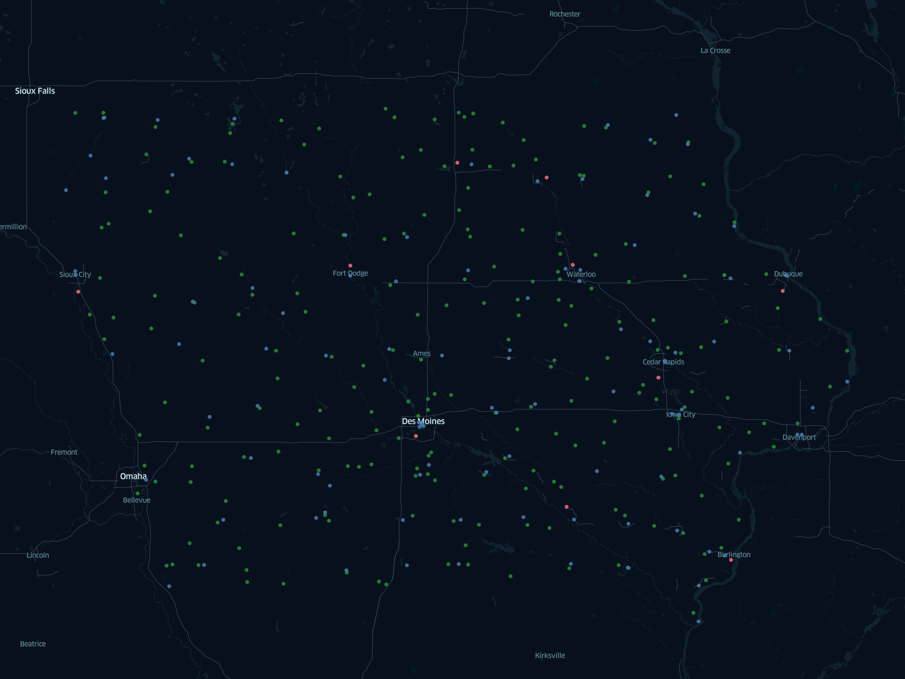
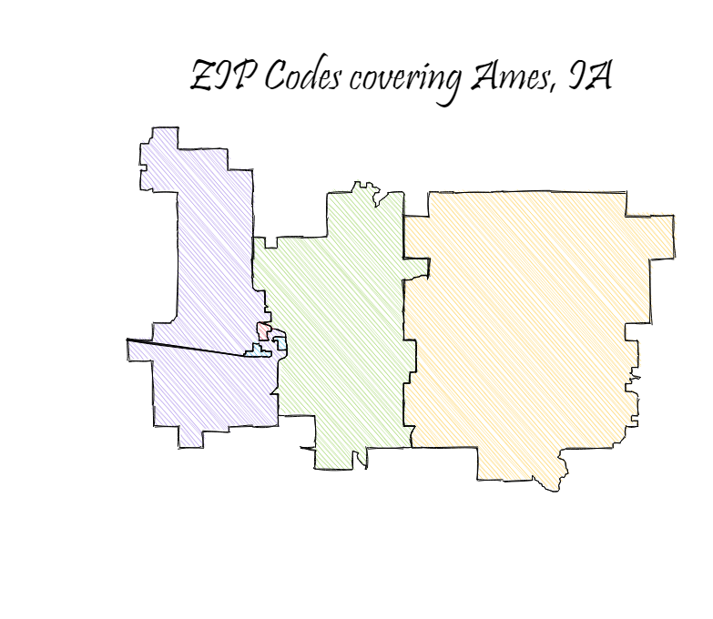
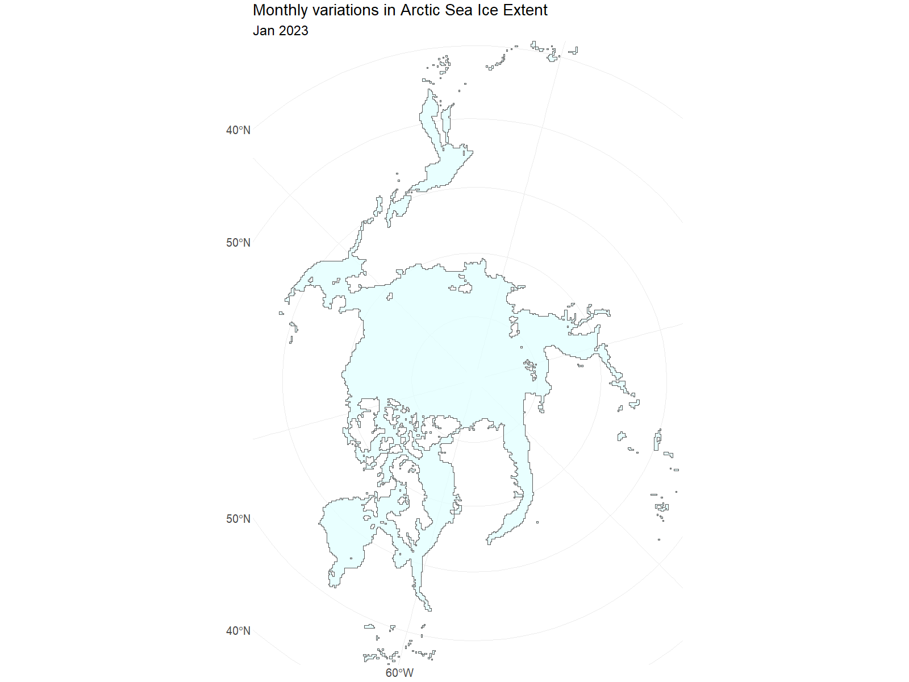

# 30DayMapChallenge 2024 Submissions
My submissions for the 2024 iteration of the 30DayMapChallenge.

## Day 1 - Points
The map preview shows the locations of CyRide's--public transportation agency serving Ames, Iowa--bus stops in the year 2022.

[Explore Map](https://studio.foursquare.com/map/public/af7fb009-7f81-447d-9600-3ff0574911b5)

## Day 2 - Lines
The map preview shows CyRide's bus routes during regular weekdays in the year 2022.

[Explore Map](https://studio.foursquare.com/map/public/818b7261-e5ea-486e-9a0a-ab809c5bd7e9)

## Day 3 - Polygons
The map preview shows 2020 Ames population count by Census Block Group (CBG). CBGs that intersect with Ames boundary are included in the map.

[Explore Map](https://studio.foursquare.com/map/public/6450d397-6972-4f01-b4a3-25831804f249)

## Day 4 - Hexagons
The map shows 2024 September arrests/charges by Ames Police Department.

[Explore Map](https://studio.foursquare.com/map/public/2a2cfbab-9b31-47c2-ab5d-0d6ce5c4d141)

## Day 5 - A Journey
The map shows potential destinations that you can go to on a bus journey from Ames.

[Explore Map](https://studio.foursquare.com/map/public/581eb003-9734-4a7a-91e7-ce2e2fdc2ea9) | [View Data Source](https://ride.jeffersonlines.com/locations/ia/166-ames)

## Day 6 - Raster
The map shows elevation raster data for Ames.

[Explore Map](https://ashirwad.github.io/30-day-map-challenge-2024/maps/day06-raster.html)
[View Data Source](https://cran.r-project.org/web/packages/elevatr/index.html)

## Day 7 - Vintage Style
The map shows how Ames and surrounding areas looked way back in 1912!

[Explore Map](https://ashirwad.github.io/30-day-map-challenge-2024/maps/day07-vintage-style.html)
[View Data Source](https://ngmdb.usgs.gov/topoview/viewer/#12/42.1373/-93.6174)

## Day 8 - HDX
The map shows airports in Iowa in 2024.

[Explore Map](https://studio.foursquare.com/map/public/9c5f8b99-4f25-4ae2-80b5-a80e365f8c46)
[View Data Source](https://data.humdata.org/dataset/ourairports-usa)

## Day 9 - AI
The image shows a comparison between AI-generated map of Iowa State University Campus with the actual map.

[Explore Map](https://ashirwad.github.io/30-day-map-challenge-2024/maps/day09-ai.html)
[View Data Source](https://stablediffusionweb.com/)

## Day 10 - Pen & Paper
The image shows a sketchy map of ZIP Codes covering Ames, IA.

[Explore Map](https://ashirwad.github.io/30-day-map-challenge-2024/maps/day10-pen-paper.html)
[View Data Source](https://cran.r-project.org/web/packages/tigris/index.html)

## Day 11 - Arctic
The image shows the monthly variations in Arctic sea ice extent in 2023. As evident from the animation, sea ice extent typically peaks around March and reaches its minimum in September.

[View Data Source](https://noaadata.apps.nsidc.org/NOAA/G02135/north/monthly/shapefiles/shp_extent/)

## Day 12 - Time and Space
The map shows how the heatmap of traffic crashes in Ames, IA, changes every 3 months during the time period between 2019 and 2021.

[Explore Map](https://studio.foursquare.com/map/public/a5598c54-91fa-4312-a1c9-a892f9586f1a)
[View Data Source](https://data.iowadot.gov/datasets/IowaDOT::crash-data-sor/api)
