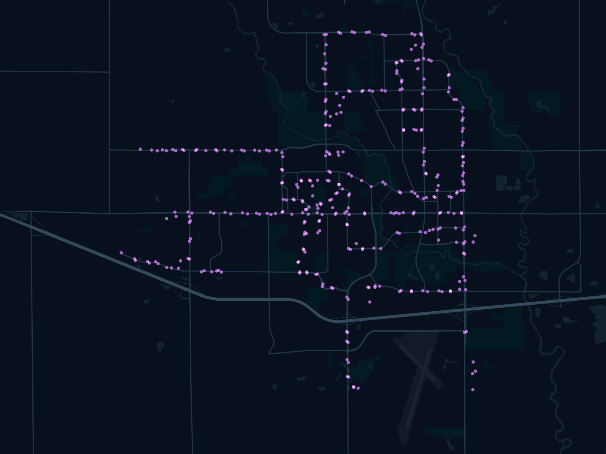
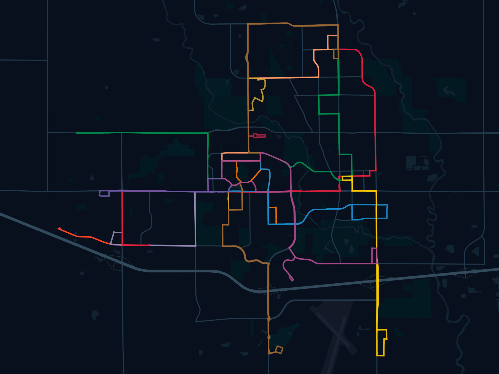
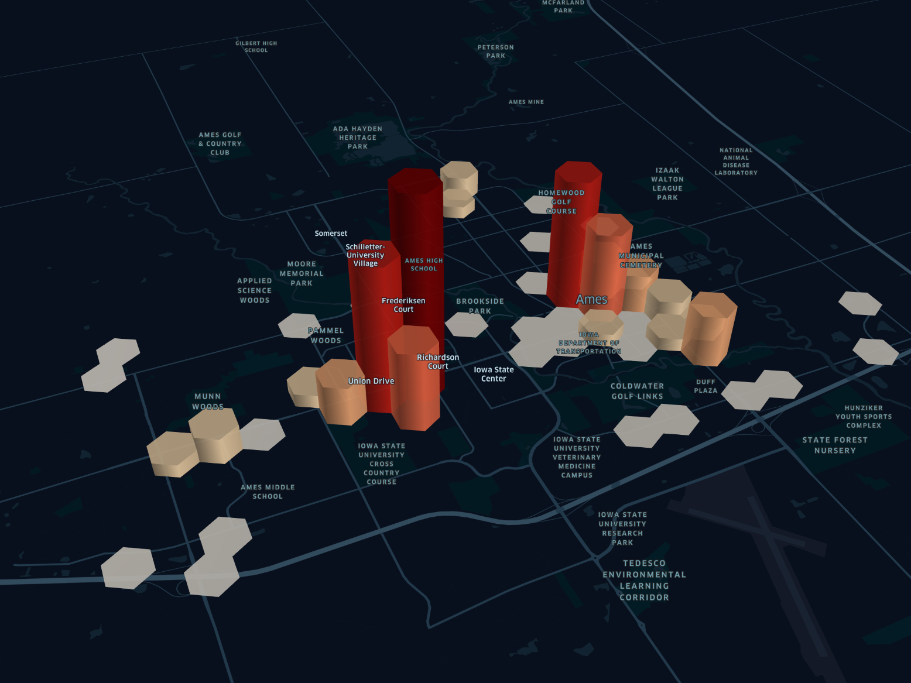
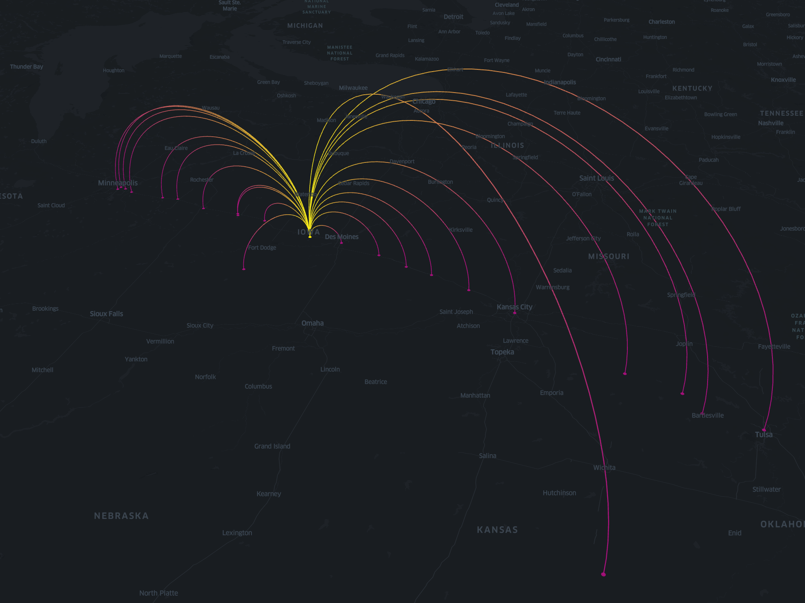

# 30DayMapChallenge 2024 Submissions
My submissions for the 2024 iteration of the 30DayMapChallenge.

## Day 1 - Points
The map preview shows the locations of CyRide's--public transportation agency serving Ames, Iowa--bus stops in the year 2022.

[Explore Map](https://studio.foursquare.com/map/public/af7fb009-7f81-447d-9600-3ff0574911b5)

## Day 2 - Lines
The map preview shows CyRide's bus routes during regular weekdays in the year 2022.

[Explore Map](https://studio.foursquare.com/map/public/818b7261-e5ea-486e-9a0a-ab809c5bd7e9)

## Day 3 - Polygons
The map preview shows 2020 Ames population count by Census Block Group (CBG). CBGs that intersect with Ames boundary are included in the map.

[Explore Map](https://studio.foursquare.com/map/public/6450d397-6972-4f01-b4a3-25831804f249)

## Day 4 - Hexagons
The map shows 2024 September arrests/charges by Ames Police Department.

[Explore Map](https://studio.foursquare.com/map/public/2a2cfbab-9b31-47c2-ab5d-0d6ce5c4d141)

## Day 5 - A Journey
The map shows potential destinations that you can go to on a bus journey from Ames.

[Explore Map](https://studio.foursquare.com/map/public/581eb003-9734-4a7a-91e7-ce2e2fdc2ea9) | [View Data Source](https://ride.jeffersonlines.com/locations/ia/166-ames)
